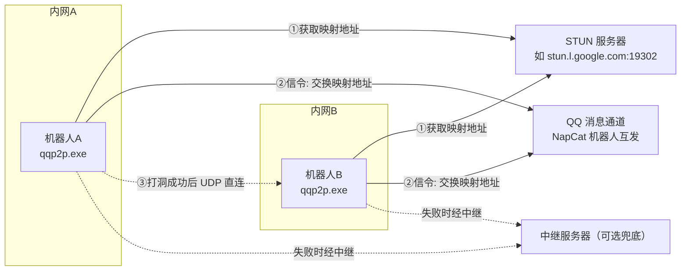
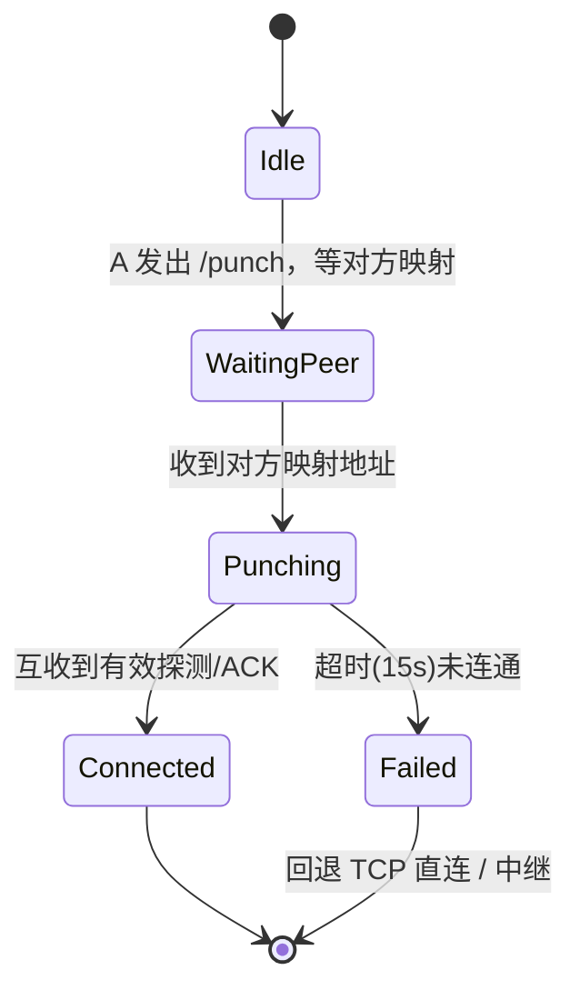

# P2P 打洞（NAT 穿越）模块调研与实现方案

> 项目：QQP2P（Rust + NapCat QQ 机器人）
> 日期：2026-08-19
> 目标：为两台 QQ 机器人之间建立不依赖公网 IP / 端口转发的 P2P 直连

---

## 1. 现状分析：为什么现在的直连经常失败

当前 `src/napcat.rs` 中 `P2PNode` 的逻辑：

| 数据 | 实际含义 | 问题 |
|------|---------|------|
| `node.ip` | 通过 `api.ipify.org` 等 HTTP 服务获取的**出口公网 IP** | 这是 NAT 网关的 IP，**不是**你的机器在公网上的可用地址 |
| `node.port` | 在 `0.0.0.0:port` 上 TCP 监听的内网端口 | NAT 默认**不会**把公网端口转发到这个内网端口 |
| `connect_to_peer(ip, port)` | 直接 TCP 连接对方给的 `ip:port` | 连接的是对方 NAT 网关的 IP:端口，包被丢弃 |

**结论**：现有 `P2P节点信息` 交换协议只有在以下情况才能连通：
- 对方有**公网 IP**（无 NAT）；
- 对方路由器手动配置了**端口映射（DMZ/端口转发）**；
- 双方在**同一局域网**内（直连内网 IP）。

要让"两个普通家庭宽带/手机热点下的机器人"直连，必须做 **NAT 打洞（Hole Punching）**。

---

## 2. NAT 基础原理（必读）

### 2.1 NAT 干了什么
内网设备 `192.168.x.x:port` 访问公网时，NAT 网关会把它改写成 `网关公网IP:新端口` 并记录一张映射表。**只有"内网先发过包"这一方向才建立映射**——外部主动发来的包默认被丢弃。

### 2.2 NAT 的两个维度（RFC 5389 新分类）

**映射行为（Mapping Behavior）——决定"洞"长什么样：**

| 类型 | 行为 | 可否打洞 |
|------|------|---------|
| Endpoint-Independent Mapping（不依赖目的） | 同一个内网 socket，不管发给谁，映射的公网端口**固定不变** | ✅ 最容易 |
| Address-Dependent Mapping（依赖目的 IP） | 目的 IP 变了，映射端口就变 | ⚠️ 需端口预测 |
| Address-and-Port-Dependent Mapping（依赖目的 IP:端口） | 目的 IP **或**端口变了，映射就变 | ⚠️ 需端口预测，难 |

**过滤行为（Filtering Behavior）——决定"入站包放不放行"：**

| 类型 | 放行条件 | 可否打洞 |
|------|---------|---------|
| Endpoint-Independent Filtering | 只要内网发过包（任意目标），任何来源都放行 | ✅ 最宽松 |
| Address-Dependent Filtering | 只放行"内网曾经发给过这个 IP"的数据 | ✅ |
| Address-and-Port-Dependent Filtering | 只放行"内网曾经发给过这个 IP:端口"的数据 | ✅（打洞后恰好满足） |

> 家用路由器的典型组合：**Endpoint-Independent Mapping + Port-Dependent Filtering** → 打洞成功率最高的类型。
> 手机热点、企业/校园网常见 **Symmetric NAT（对称型）**（映射和过滤都依赖目的）→ **UDP/TCP 打洞基本失败**，只能靠中继。

### 2.3 对称 NAT 为什么难
对称 NAT 对每个"目的地址"都分配不同的公网端口。A 向 STUN 问到的端口是 `a1`，但 A 向 B 发包时会用**另一个端口** `a2`，B 往 `a1` 发就永远打不中。对策是**端口预测**（收集映射规律猜下一个端口）或直接**中继兜底**。

---

## 3. 打洞核心原理

### 3.1 UDP 打洞（主方案，成功率最高）

三步核心思想：**① 建立映射 → ② 通知对端 → ③ 双方同时发包**。

以本项目为例，利用 QQ 消息作为信令通道：

```mermaid
sequenceDiagram
    participant A as 机器人A(NAT后)
    participant S as STUN服务器(公网)
    participant Q as QQ信令通道(NapCat)
    participant B as 机器人B(NAT后)

    A->>S: Binding Request（获取映射地址）
    S-->>A: 返回 ipa:porta
    A->>Q: 发送自己的映射地址(ipa:porta)
    Q->>B: QQ消息转发
    B->>S: Binding Request
    S-->>B: 返回 ipb:portb
    B->>A: 向 ipa:porta 发探测包(并持续重发)
    B->>Q: 回发自己的映射地址(ipb:portb)
    Q->>A: QQ消息转发
    A->>B: 向 ipb:portb 发探测包(并持续重发)
    Note over A,B: A的NAT: B发过包给A→放行B的包<br/>B的NAT: A发过包给B→放行A的包
    A<->B: ✅ UDP 数据通道建立
```

**关键点：**
1. **打洞前必须先"向外发过包"**：A 向 B 发包的那一刻，A 的 NAT 才记录 B；同理 B 也先向 A 发过包。
2. **同时性靠"持续重发"解决**：QQ 消息有几百 ms~几秒延迟，不要指望一次命中。双方在会话期间**每 200~500ms 重发一次探测包，持续 10~15 秒**，总有一个时间窗口两边 NAT 规则同时就绪。
3. **验证**：探测包带 magic + 对端 user_id，收到即回 ACK；双方互收 ACK 即确认打洞成功。

### 3.2 TCP 打洞（辅助，成功率低）
原理是 **TCP 同时打开（Simultaneous Open）**：双方都 `bind` 同一端口（需 `SO_REUSEADDR`/`SO_REUSEPORT`），同时 `connect` 对方的映射端口，让 NAT 看到"双向同时发起连接"。

成功率低的原因：
- NAT 对 TCP 入站限制更严；
- 普通 socket API 无法"同时监听 + 主动连接"同一个 socket；
- 部分 TCP/IP 协议栈不支持同时打开；
- TIME_WAIT 状态易引发误判。

### 3.3 中继兜底（Relay / TURN）
打洞失败（如对称 NAT）时的保底方案：数据经一个**公网服务器**转发。
- 标准协议：TURN（RFC 5766），可用开源 `coturn` 自建；
- 本项目轻量版：自建一个极简 TCP/UDP 转发服务器（几十行代码即可），机器人与服务器保持长连接，互相转发。
- 成本：需要一台公网 VPS；带宽、流量都经过服务器。

---

## 4. 本项目落地方案

### 4.1 总体架构



### 4.2 为什么"QQ 消息 = 信令通道"是最优解

| 传统 P2P 方案 | 本项目方案 |
|--------------|-----------|
| 需要自建/租用信令服务器 | **直接用 QQ 消息**（已有 NapCat 收发通道，零成本） |
| 需要维护信令长连接 | 机器人之间通过 QQ 协议消息握手，断线由 QQ 兜底 |
| 身份认证复杂 | 用 QQ 号 `user_id` 天然唯一标识 |

信令协议只需要扩展现有文本协议，例如：

```
# A 发起打洞（现有流程1 扩展）
"@B 请给我一个p2p"        → 自动触发 A 获取 STUN 映射
A 回复: [CQ:at,qq=B] 🌐 P2P打洞: udp://ipa:porta 会话=xxxx

# B 收到后（现有流程2 扩展）
B 解析 A 的映射 → 立即向 ipa:porta 发包 → 回发自己的映射
B 回复: [CQ:at,qq=A] 🌐 P2P打洞: udp://ipb:portb 会话=xxxx
```

> 会话 ID 用于区分同一对用户的多轮打洞，避免旧消息干扰。

### 4.3 推荐方案：轻量自研（不引入完整 ICE）

**候选方案对比：**

| 方案 | 依赖 | 复杂度 | 可控性 | 建议 |
|------|------|--------|--------|------|
| A. 轻量自研：STUN 取映射 + 手写打洞状态机 | `stun`/`stunclient` + tokio | 低 | 高 | ✅ **首选** |
| B. `webrtc-ice` 完整 ICE 栈 | webrtc-ice + stun + turn | 高 | 低 | 不推荐（API 重，与 QQ 信令整合繁琐） |
| C. 手写 STUN 报文（20 字节 Binding Request） | 零依赖 | 中 | 最高 | 可选（响应要解 XOR 混淆，易错） |

**推荐 A 的理由：**
- 打洞逻辑本身不复杂（并发 `sendto` + 监听 `recv` + 超时重试），自己写完全可控；
- STUN 只做一件事：拿映射地址，用现成 crate 最稳；
- 与现有项目"简单直白"的风格一致（现在也是手写 PING/PONG 协议）；
- 后续想升级 QUIC 可靠传输、或换成 ICE，接口可平滑替换。

### 4.4 数据通道演进

| 阶段 | 数据通道 | 说明 |
|------|---------|------|
| M1 | **UDP 明文**（自定义报文） | 打洞后互发 PING/PONG 级数据，验证连通即可 |
| M2 | UDP + 简单确认重传 | 手写 seq/ack，适合传小文件、文本 |
| M3 | **QUIC（`quinn` crate）** | UDP 之上提供可靠流 + TLS 加密，传输大文件/多路复用；打洞成功后 `quinn::Endpoint` 直接连接映射地址即可 |

### 4.5 打洞会话状态机（建议 `src/holepunch.rs`）



**核心逻辑（伪代码）：**

```rust
// 1) 获取自己的 NAT 映射地址
let my_mapped: SocketAddr = stun_client
    .query_public_address(bind_addr)
    .await?;  // e.g. 111.22.33.44:54321

// 2) 通过 QQ 把 my_mapped 发给对方（信令）

// 3) 收到对方映射 peer_mapped 后：
let sock = UdpSocket::bind(bind_addr).await?;   // 必须用同一个 bind 端口！
let task = tokio::spawn(async move {
    // 持续向 peer_mapped 发包（200ms 间隔，共 50 次）
    // 同时监听 sock，收到带 magic 的包即回 ACK
    // 互收 ACK → 打洞成功，切换到数据收发循环
});
```

> ⚠️ 注意：`query_public_address` 和后续打洞 `bind` 必须使用**同一个内网 socket/端口**，否则映射关系不成立（这就是"映射一致性"）。

### 4.6 模块划分建议

```
src/
  holepunch.rs   # 新增：STUN 映射获取、打洞会话状态机、UDP 探测/ACK、数据收发
  napcat.rs      # 改造：P2PNode 增加 hole_punch 会话、/punch 协议解析
  app.rs         # 改造：handle_message 增加 /punch、/punch 应答流程（复用流程1/2）
  relay.rs       # 后续可选：中继客户端（兜底）
```

---

## 5. Rust 生态选型

| Crate | 用途 | 备注 |
|-------|------|------|
| [`stun`](https://crates.io/crates/stun)（webrtc-rs） | STUN 协议（异步） | 获取映射地址、NAT 类型探测 |
| [`stunclient`](https://crates.io/crates/stunclient) | STUN 客户端（同步，极简） | 一行拿映射地址，M1 首选 |
| [`tokio`](https://crates.io/crates/tokio) | UDP/TCP 异步运行时 | 已有 |
| [`quinn`](https://crates.io/crates/quinn) | QUIC（M3 数据通道） | UDP 之上可靠+加密 |
| [`socket2`](https://crates.io/crates/socket2) | `SO_REUSEADDR`/`SO_REUSEPORT` | TCP 打洞辅助（M2 可选） |
| [`local-ip-address`](https://crates.io/crates/local-ip-address) | 本机内网 IP | 局域网直连场景（可选） |

**免费公共 STUN 服务器：**
- `stun.l.google.com:19302`
- `stun1.l.google.com:19302`
- `stun.cloudflare.com:3478`

> STUN 只用于获取映射地址，服务器本身不转发数据，无隐私问题；打洞成功后数据直接 P2P 明文传输（QQ 场景建议 M3 加 QUIC 加密）。

---

## 6. 分阶段实施计划

### M1：基础 UDP 打洞（核心，约 1~2 天）
1. `holepunch.rs`：封装 STUN 映射获取（`stunclient` 或 `stun`）；
2. 扩展 QQ 信令：`/punch` 发起 + 映射地址交换（复用现有流程 1/2）；
3. 打洞状态机：并发发包 + 监听 + 超时重试（200ms 间隔 × 50 次）；
4. 连通验证：`HOLEPUNCH` / `HOLEPUNCH-ACK` 互收确认；
5. 结果回 QQ：成功 → 报告对方映射地址；失败 → 提示走 TCP 直连/中继。
6. **测试**：手机热点（NAT） vs 家庭宽带（NAT）、同一局域网、公网 IP 各一组。

### M2：增强（按需）
- NAT 类型自探测（RFC 5780 流程，向多 IP:端口 STUN 发请求判断映射/过滤行为）；
- 对称 NAT 端口预测（连续取多次映射，外推下一个端口，让对端向预测端口发包）；
- TCP 同时打开辅助（`socket2` + SO_REUSEADDR，UDP 被禁网络环境）。

### M3：可靠传输 + 中继兜底
- 打洞成功后用 `quinn` 承载可靠流（文件传输）；
- 自建极简中继服务器（TCP 长连接转发）作为对称 NAT 兜底；
- 或接标准 TURN（coturn）。

---

## 7. 风险与限制

| 风险 | 影响 | 对策 |
|------|------|------|
| 对称 NAT（手机热点/校园网/企业网） | 打洞失败率极高 | M2 端口预测；M3 中继兜底 |
| 运营商对 UDP 的 QoS 限制/封锁 | 打洞成功但速率低 | M2 TCP 同时打开辅助 |
| QQ 消息延迟导致打洞窗口错开 | 首轮失败 | 持续重发（10~15s）+ 多轮握手 |
| 打洞成功后 NAT 映射超时（空闲） | 连接中途断开 | 心跳保活（每 15~30s 发 keepalive） |
| 防火墙拦截 UDP | 完全无法打洞 | 回退 TCP 直连 / 中继 |

---

## 8. 参考资源

- RFC 3489（STUN 旧版）、RFC 5389（STUN 新版）、RFC 5780（NAT 行为发现）、RFC 5766（TURN）、RFC 8445（ICE）
- 腾讯云开发者社区《P2P技术详解(三)：P2P中的NAT穿越(打洞)方案详解》
- 百度云《P2P通信必知：NAT穿透原理全解析》
- Rust 参考：webrtc-rs/webrtc（stun、ice 模块）、rust-libp2p（NAT 穿越实践）

---

## 9. FAQ：为什么 HTTP 能拿到公网 IP，却拿不到端口号？

### 9.1 用 HTTP（api.ipify.org 之类）访问公网服务器，能看到端口吗？

**看不到，也不该用。**

HTTP 走的是 TCP。当你 `curl ipify.org` 时：

1. 你的机器 `192.168.1.5:50000` 发起连接；
2. NAT 网关把源地址改写成 `网关公网IP:61000`（这个 61000 是 **NAT 临时分配的**）；
3. HTTP 服务器只回显了源 **IP**（ipify 的设计就是只回显 IP）；
4. 响应返回后 **TCP 连接关闭**，NAT 把 61000 这条映射**立刻/短时间后删除**。

所以即使你从抓包里看到了那个源端口 61000，它也**绑定在一条已经关闭的 TCP 连接上**，别人再往 `网关公网IP:61000` 发包，NAT 查不到映射表 → 直接丢弃，根本进不了你的机器。

> 一句话：HTTP 拿到的端口是"用完就扔的一次性临时端口"，无法复用来做通信。

### 9.2 换成 STUN 就能拿到端口吗？

**能，这正是 STUN 的核心作用。**

STUN 是 UDP 协议（RFC 5389），原理：客户端发一个 20 字节的 Binding Request，服务器**把收到的源 IP 和源端口原样回显**（端口用 XOR 混淆编码，防止中间设备乱改）。

关键区别在于**"活"**：

| | HTTP (TCP) | STUN (UDP) |
|---|---|---|
| 服务器回显什么 | 只回显 IP | **回显 IP + 源端口** |
| 拿到端口后能用吗 | 不能，连接已关、映射已删 | 能，只要你的 UDP socket 一直开着 |
| NAT 映射寿命 | 连接结束即删（几秒~几十秒） | 靠持续发包维持（30 秒~2 分钟） |
| 用途 | 只能知道自己"从哪个门牌号出去" | 拿到"门牌号+房门钥匙"，对端能敲门 |

UDP 是"无连接"的：你的 socket 打开后 NAT 就长期保留这条映射（期间只要时不时发个 keepalive 包续命）。对方往 `你的公网IP:映射端口` 发包，NAT 就转发到你的 socket 里——**这个端口就是打洞的"洞口"**。

### 9.3 那为什么还要打洞？不是拿到端口就行了吗？

拿到"公网 IP:映射端口"只是**一半**：

- 你的 NAT 拿到映射 ≠ 对方能打进来。对方发包进来时，你的 NAT 要检查过滤规则（第 2.2 节）——只有**你也先向对方发过包**，过滤规则才放行。这就是"双方同时发包"的由来。
- 对称 NAT 下，发给 STUN 的端口和发给对方的端口**不是同一个**（第 2.3 节），需要端口预测或中继。

### 9.4 现有代码只拿 IP 够吗？

不够。`P2PNode.ip` 拿到的只是"从哪个 IP 出去"，没有可复用的映射端口，所以现有 TCP 直连只能碰运气（对方有公网 IP / 端口转发 / 同局域网）。

**改造后**：用同一个 UDP socket 做 STUN 查询 → 拿到映射端口 → 打洞 → 数据通道。IP 依然有用（局域网内直连场景可以直接用内网 IP，更快）。
