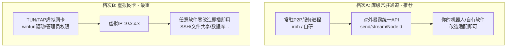

# P2P 打洞现状调研与虚拟局域网方案评估

> 调研时间：2026-08
> 关联代码：`src/holepunch.rs`、`src/p2p.rs`
> 关联文档：`docs/P2P_HOLE_PUNCHING.md`

---

## 一、当前打洞的不足

**核心结论**：现有实现核心原理正确（映射一致性、双方并发发包、动态更新映射都做到了），当前是"能打通"的 M1 级别，离"可用基础设施"还差 4 个硬伤和若干隐患。

### 1.1 硬伤（影响成功率）

| # | 不足 | 现状 | 后果 |
|---|------|------|------|
| 1 | **无 NAT 类型探测** | 没有 RFC 5780 流程（多 IP:port 探测判断映射/过滤行为） | 遇到对称 NAT 只能"盲打"，浪费 10 秒+多轮后才失败，且无法预判该直接走中继 |
| 2 | **无中继兜底** | 失败只提示"可回退 TCP 直连"，实际没有任何 fallback | 手机热点（对称 NAT）、企业网、CGNAT、UDP 被禁的网络 **100% 失败** |
| 3 | **单 STUN 服务器** | 只有 `stun.l.google.com`，失败即重试同一个 | 国内部分网络连 Google STUN 不通（或被 UDP QoS 限流），无备用（cloudflare 等） |
| 4 | **无多候选收集** | 只有"STUN 映射地址"一个候选，没有：同局域网内网 IP 直连、多 STUN 候选、端口预测候选 | 同 LAN 的两台机器也要绕 STUN 打洞（本该直连更快）；对称 NAT 无应对手段 |

### 1.2 隐患（影响可靠性/安全性）

| # | 不足 | 说明 |
|---|------|------|
| 5 | **明文 + 无认证** | `HOLEPUNCH`/`ACK` 无签名无校验。打洞成功后 UDP 端口对公网是"开口"的，任何人往映射端口发包都能进来、能伪装 ACK 造成"假连通" |
| 6 | **数据面无保活** | `keepalive_loop` 只向 **STUN** 发包保活 NAT 映射，但打洞成功后的**对端通道**没有心跳——NAT 空闲映射超时（常见 30s~2min）后连接悄然断开，无感知、无自动重打 |
| 7 | **无可靠传输/无加密** | 明文 UDP、丢包无重传，只能传探测级数据，文档里的 M3（QUIC 加密）尚未落地 |
| 8 | **会话表 key 单一** | `hole_sessions` 以 `peer_user_id` 为 key，同一 QQ 号并发多会话会互相覆盖 |
| 9 | **10054 刷屏** | `ConnectionReset` 后 sleep 500ms 继续，持续收到会无限打印（不崩但不优雅） |

**一句话总结**：M1 的"打通"验证目的已经达成，但**没有中继兜底 = 成功率天花板取决于运气**，**没有加密 = 永远不能当正式通道用**。

---

## 二、成熟方案：可以直接"调 API"的选项

按"贴近现有架构"排序，分三个层次。

### 2.1 层次 A：成熟 P2P 库（嵌入代码，最推荐）

| 库 | 打洞 | 中继 | 加密/可靠 | API 友好度 | 备注 |
|---|---|---|---|---|---|
| **iroh**（n0-team） | ✅ 内置 | ✅ 内置（公共 relay 免费，可自建 derper） | ✅ QUIC+TLS | **极高**：`NodeId`（Ed25519 公钥）拨号，不用管 IP/NAT | **2026-06 发布 1.0 稳定版**，Rust 单实现，官网宣称穿透成功率明显高于 libp2p（~70%），代码量 9.6k star，最贴合当前场景 |
| **rust-libp2p** | ✅（但配置复杂） | ⚠️ 需自己搭 relay | ✅ | 中：概念多（identify/kad/relay…） | IPFS/以太坊验证过，多语言生态，但上手陡峭 |
| **webrtc-rs** | ✅ 内置完整 ICE(STUN/TURN) | ✅ | ✅ DTLS/SRTP | 中 | 适合"浏览器也要参与"或音视频，信令仍需自建 |
| **quinn** | ❌ 只做传输 | ❌ | ✅ QUIC | 高 | M3 的候选，需自己先打洞 |

> **iroh 就是"常驻后台 + 统一 API"的现成实现**——它的 `Endpoint` 常驻后台、自动打洞、自动 relay 兜底、自动保活、QUIC 可靠流+加密，对外只需一个公钥地址。要做的只剩：**用 QQ 消息把双方 NodeId 交换一下**（信令复用现有 NapCat 通道），后续 `connect(node_id)` 即可。改动量小、收益最大。

### 2.2 层次 B：现成产品/服务（开箱即用）

| 产品 | 形态 | 打洞 | 国内可用性 | 适合谁 |
|---|---|---|---|---|
| **ZeroTier** | 虚拟**二层**网卡（真·虚拟局域网） | ✅ 高，可自建 moon 提升 | 相对可用，可自建 controller | 想"任何软件即插即用" |
| **Tailscale** | 虚拟三层（WireGuard） | ✅ 高 | 控制面(dtail)不稳，需自建 Headscale | 个人设备组网 |
| **Nebula** | 证书化 mesh | ✅ 高 | 需自建 lighthouse | 有公网 VPS 做灯塔 |
| **frp** | 反代中继（**非 P2P**） | ❌ 全中继 | ✅ 好 | 简单但带宽/延迟受限 |

### 2.3 层次 C：自建兜底（最小改动）

- 一台 VPS 跑 **coturn**（TURN，RFC 5766），只当打洞失败时的中继——这是对现有代码**改动最小**的补强（现有打洞逻辑保留，失败时走 TURN）。

---

## 三、"双方以为在同一个局域网"的想法评估

**这个想法完全正确，而且就是业界验证过的形态**——Tailscale / ZeroTier / Nebula 本质上都是它（Overlay Network / Mesh VPN）。但有两个实现档次，成本天差地别：

### 3.1 两档对比

| 维度 | 档次A：常驻 P2P 通道 + 统一 API | 档次B：真虚拟网卡 |
|------|------|------|
| 应用接入成本 | 低（你的软件调 API） | **零**（第三方软件透明使用） |
| 打洞复用 | ✅ 一次建立长期复用 | ✅ 一次建立长期复用 |
| 加密 | iroh 内置 / 自研需自己加 | **必须自己加**（WireGuard/Noise），否则内网裸奔公网 |
| 复杂度 | 中（iroh 几乎免费送你） | **高**：驱动安装（管理员权限、签名）、路由表管理、防火墙、跨平台、断线重连 |
| 失败兜底 | iroh 内置 relay | 需自建 TURN/中继 |
| 落地周期 | 几天 | 几周~几个月 |
| 依赖第三方 | 无（开源库） | 无/有（看用不用 ZeroTier） |

### 3.2 关键结论

1. **"常驻后台 + 任何软件复用一条 P2P 连接"**——本质是"连接池 + 统一寻址"。**iroh 恰好就是这个形态**：常驻 `Endpoint`、公钥寻址、QUIC 多路复用（一条 UDP 通道上开任意多 stream）、打洞/中继/保活全自动。性价比最高，**建议作为下一步主攻方向**。

2. **虚拟网卡（档次B）只有在"不认识的第三方软件也要跑在这个网络"时才值回票价**。对个人项目，驱动/权限/加密/路由的维护成本远超收益。除非想体验 ZeroTier 直接把两台机器拉进同一网段——那也不用自己写，**直接用 ZeroTier（免费版 25 设备，可自建 moon/controller）** 就行。

3. **无论哪条路，"打洞失败兜底"和"数据加密"都是绕不开的**——这是从"演示打通"到"正式基础设施"的分水岭。

---

## 四、综合推荐路线

| 阶段 | 动作 | 工作量 |
|------|------|--------|
| **短期**（1~2 周） | 用 **iroh** 替换/并行现有打洞：QQ 信令交换 NodeId → `iroh::Endpoint::connect`，获得加密可靠通道 | 小 |
| **中期**（1 个月） | 把 iroh 封装成自己的 `P2PService` 常驻后台，暴露 `send/stream` API，机器人各模块统一走它——这就是"基础设置" | 中 |
| **可选**（有硬需求时） | 真虚拟局域网：**接入 ZeroTier**（嵌入 SDK 或自建 moon），别自己写 TUN 驱动 | 小~中 |

> **对比自研补全现有打洞的成本**：需要自己做 NAT 类型探测 + 端口预测 + TURN 客户端 + Noise/QUIC 加密 + 保活重连 + 多候选……这套东西 iroh 已经成熟封装，自研是重复造轮子，且可靠性难追平。

---

## 附：下一步可执行项

- [ ] 写 iroh + QQ 信令的 POC 设计文档（NodeId 交换协议、对接现有 NapCat 通道）
- [ ] 对比 iroh 与 ZeroTier 在当前场景的具体接入代码骨架
- [ ] 继续补强现有打洞（TURN 兜底 / 加密）的具体方案
