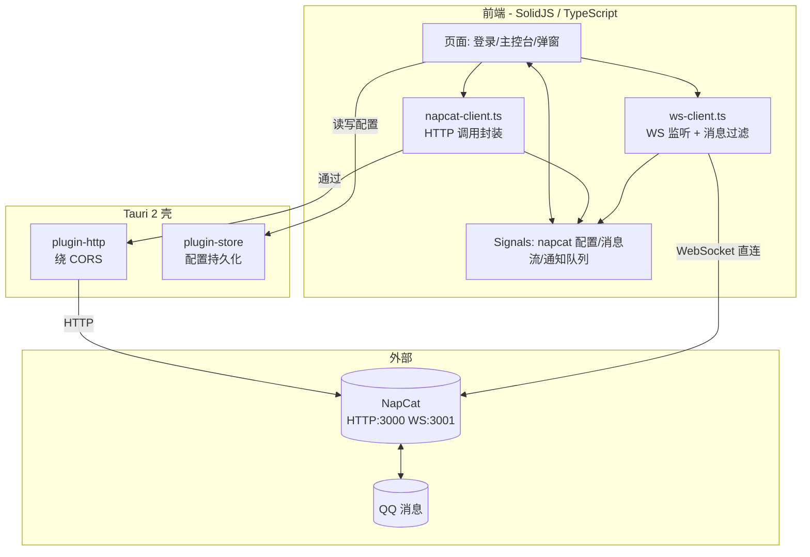
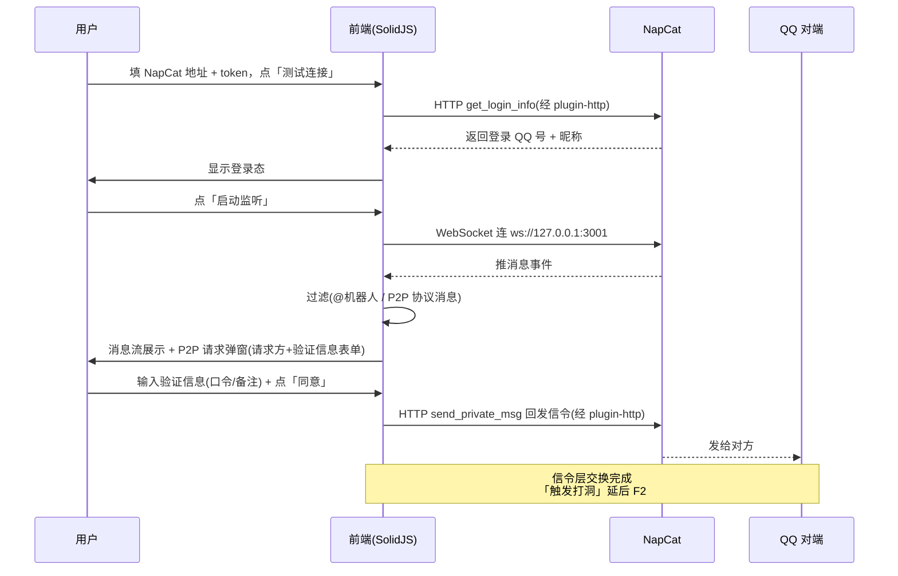

# QQP2P 前端工具页面实施计划（FRONTEND_PLAN）

> 文档时间：2026-08-29（v4：重排为 F0-F4 里程碑结构，对齐 P2P_INFRA_PLAN 的 N 系列风格）
> 关联文档：[P2P_INFRA_PLAN.md](P2P_INFRA_PLAN.md)（N0-N5 后端里程碑）、[P2P_HOLE_PUNCHING.md](../legacy/P2P_HOLE_PUNCHING.md)（MVP 打洞）
> 现状参考：NapCat 接口已在 [napcat.rs](../../src/napcat.rs) / [ws.rs](../../src/ws.rs) 跑通；P2P 打洞后端（[p2p/](../../src/p2p/)）尚不完全，本期不接。
> 决策影响：作为前端实施图纸，里程碑任务照此执行。

---

## 一、决策结论

多轮讨论后，方向已定死：

| 决策项 | 结论 | 理由 |
|---|---|---|
| 本期范围 | **只做前端与 NapCat 交互** | P2P 打洞后端未完全，先打通「登录→监听→弹窗→同意回发信令」 |
| 「触发打洞」 | 延后 **F2**（后端就绪后） | 实际建连需 Rust holepunch/QUIC；本期「同意」= 通过 NapCat 回发信令（QQ 消息层，MVP 验证过） |
| UI 框架 | **SolidJS**（solid-js） | 细粒度响应式 Signal、无虚拟 DOM diff、产物小、JSX 语法 |
| 桌面容器 | **Tauri 2**（@tauri-apps/api） | 桌面 + 安卓；为后续 P2P 打洞（UDP 需原生层）留路径；本期 Rust 后端零逻辑 |
| 路由/数据 | **TanStack 全家桶**（solid-router / solid-query；store/virtual 按需） | 100% 类型安全路由 + HTTP 缓存；已核实 Solid 适配均存在 |
| 本地持久化 | **@tauri-apps/plugin-store**（JSON KV） | 不用 `@tanstack/solid-db`：它是嵌入式 DB+live query，通常配 sync 后端，对本地 P2P 工具 overkill |
| 样式 | **Tailwind CSS v4** | Oxide 新引擎、CSS-based 配置 |
| 构建 | **Vite** + `vite-plugin-solid` | Solid 官方推荐；基于 `create-tauri-app` Solid 模板改 |
| 现有 Rust 后端 | 本期**不动**，仅作接口契约参考 | 前端 TS 等价实现 napcat.rs / ws.rs 逻辑，直连 NapCat |

> 关键分工：**HTTP API → solid-query**（缓存/重试）；**WS 消息流 → Solid Signal/createStore**（持续推送，不用 Query）；**配置 → plugin-store**。

---

## 二、架构蓝图

### 分层职责

| 层 | 职责 |
|---|---|
| 前端层（SolidJS/TS） | UI、状态、NapCat HTTP/WS 调用、消息展示、P2P 请求弹窗 + 同意回发信令 |
| Tauri 壳 | plugin-http 绕 CORS、plugin-store 持久化；F2 加 Rust 后端命令 |
| 外部 | NapCat（HTTP+WS）、QQ |

---

## 三、核心数据流：NapCat 消息 → 弹窗 → 同意回发信令

---

## 四、任务计划（里程碑）

### F0 方案定稿 —— 本文档 ✅

- [x] 范围、技术栈、架构、数据流、验证信息、排期固化（本文件）
- 验收：文档评审通过

### F1 脚手架 + NapCat 交互跑通（本期，Windows）

**目标**：从零搭起 Tauri+SolidJS 工程，跑通「登录 → 监听 → 消息流 → P2P 请求弹窗 → 同意 + 验证信息 + 回发信令」完整前端流程。

任务步骤：

- [ ] F1.1 脚手架：`create-tauri-app` Solid 模板在 `frontend/` 起工程；装 `@tanstack/solid-router`、`@tanstack/solid-query`、`tailwindcss@4` + `@tailwindcss/vite`、`@tauri-apps/plugin-http`、`@tauri-apps/plugin-store`
- [ ] F1.2 `lib/napcat-client.ts`：HTTP 调用封装（plugin-http 绕 CORS），对齐 [napcat.rs](../../src/napcat.rs) 接口（`get_login_info` / `get_friends` / `send_private_msg`）
- [ ] F1.3 登录页：NapCat HTTP/WS 地址 + token + 「测试连接」→ solid-query 调 `get_login_info` → 显示 QQ 号/昵称
- [ ] F1.4 `lib/ws-client.ts`：NapCat WS 监听 + 消息过滤，对齐 [ws.rs](../../src/ws.rs)（`is_protocol_message` / `is_mentioned_bot` 的 TS 版）；消息流用 Signal/`createStore`
- [ ] F1.5 `lib/protocol.ts`：P2P 请求类消息识别（「给我一个p2p」/ 节点信息），参考 [app.rs](../../src/app.rs) 流程1/2 关键词
- [ ] F1.6 主控台：启动/停止监听开关、连接状态、消息流列表（`@tanstack/solid-virtual` 按需引入）
- [ ] F1.7 P2P 请求弹窗 `P2pRequestToast.tsx`：请求方 QQ + 消息内容 + 验证信息表单（口令/备注）+「同意/拒绝」；同意 → 调 `send_private_msg` 回发信令
- [ ] F1.8 配置持久化：plugin-store 存 NapCat 配置（地址/token），启动自动加载
- [ ] F1.9 视觉基线：Tailwind v4 布局，遵循用户偏好（开放空间、脉冲状态、弱化卡片）

验收标准：
- 填配置 → 测试连接 → 显示登录 QQ 号
- 启动监听 → WS 连上 → QQ 消息实时进消息流
- 收到「给我一个p2p」→ 弹窗 → 输入口令/备注 → 同意 → 对方 QQ 收到回发信令
- 「触发打洞」不在本期范围（F2）

### F2 P2P 打洞集成（后端就绪后）

**目标**：前端「同意」后调 Rust 后端触发实际打洞，连接结果回传展示。

任务步骤：

- [ ] F2.1 集成 `src/` 为 Tauri 后端 crate，暴露 commands（`start_hole_punch` 等）
- [ ] F2.2 [app.rs](../../src/app.rs) 流程2「自动连接」改为「前端同意后触发」
- [ ] F2.3 弹窗加「触发打洞」→ invoke 后端 holepunch/QUIC
- [ ] F2.4 打洞进度/结果用 Tauri Event 推前端展示
- [ ] F2.5 NAT 映射保活（等待确认期间映射不过期）

验收标准：
- 同意后实际建立 P2P 连接，前端显示「已连接」+ 会话详情
- 打洞失败有可读错误提示

### F3 Android 适配

**目标**：F1+F2 流程在 Android 跑通。

任务步骤：

- [ ] F3.1 Tauri Android target（`aarch64-linux-android`）+ NDK 环境
- [ ] F3.2 前台服务保活（Android 后台 WS/UDP 限制）
- [ ] F3.3 NapCat 安卓部署引导（复用 [termux_napcat.sh](../../scripts/termux_napcat.sh)）
- [ ] F3.4 UDP/WS 权限与电池优化实测

验收标准：
- 安卓设备跑通登录→监听→弹窗→同意→（F2 后）建连

### F4 打磨

- [ ] F4.1 视觉优化（开放空间 + 脉冲效果强化）
- [ ] F4.2 WS 断线重连
- [ ] F4.3 异常处理与错误提示完善
- [ ] F4.4 配置项扩展（多 NapCat 实例切换等）

---

## 五、「验证信息」（本期前端实现）

本期前端实现验证信息表单 + 随信令回发；字段定义：

| 字段 | 本期 | 用途 |
|---|---|---|
| 口令（secret） | ✅ 表单输入，随回发信令发给对方 | 双方约定，握手时携带校验（本期前端透传，不强制校验） |
| 备注 | ✅ 表单输入，本地存储标记对方 | 本地标记对方身份 |
| 虚拟 IP | ⏳ 延后 F2（N2 编排层用） | 本机虚拟 IP，默认自动分配 |

> 本期「同意」= 通过 NapCat `send_private_msg` 把口令等信令回发给对方；「触发打洞」（实际建连）延后 F2。

---

## 六、风险清单

| 风险 | 影响 | 对策 |
|---|---|---|
| NapCat HTTP 无 CORS 头 | webview 直 fetch 被挡 | 用 `plugin-http`（Rust 发起，绕 CORS） |
| NapCat WS 鉴权/格式 | 连接失败或事件解析错 | 对齐 [ws.rs](../../src/ws.rs) 已验证的事件结构；token 透传 |
| SolidJS 中文资料少 | 排错慢 | 官方文档质量高；核心 API 少（Signal/Store/Resource） |
| Tauri Android 成熟度 | F3 卡壳 | 先 Windows 跑通；Android 实测前先验证 Tauri Android WS 能力 |
| 触发打洞需后端 | 「同意」后无法实际建连 | 本期同意只回发信令（QQ 消息层）；建连延后 F2 后端就绪 |
| 安卓后台 WS 限制 | 切后台断连 | 前台服务保活；接受「前台运行」约束 |

---

## 七、验收总览

| 里程碑 | 一句话验收 |
|---|---|
| F0 | 本文件评审通过 |
| F1 | 登录 → 监听 → 消息流 → P2P 弹窗 → 同意 + 验证信息 + 回发信令（Windows） |
| F2 | 同意后触发打洞，前端显示「已连接」 |
| F3 | 安卓跑通 F1+F2 流程 |
| F4 | 视觉/重连/异常打磨完成 |
