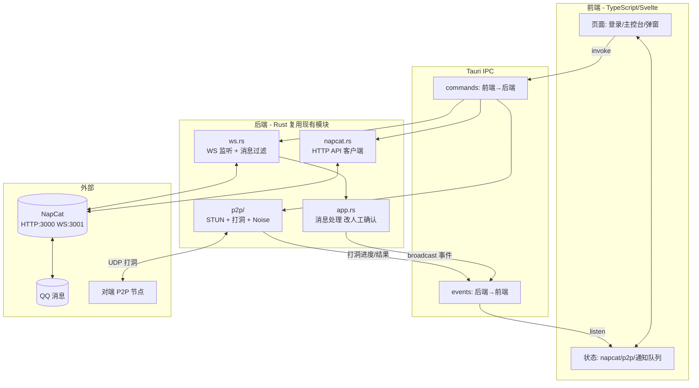
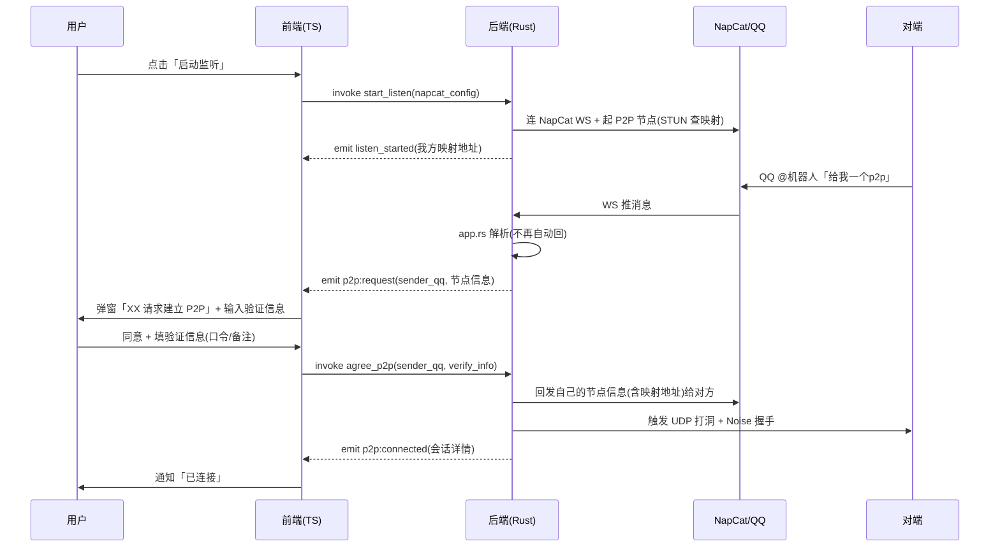

# QQP2P 前端工具页面实施计划（FRONTEND_PLAN）

> 文档时间：2026-08-29
> 关联文档：[P2P_INFRA_PLAN.md](P2P_INFRA_PLAN.md)（N0-N5 后端里程碑）、[P2P_HOLE_PUNCHING.md](../legacy/P2P_HOLE_PUNCHING.md)（MVP 打洞）
> 定位：在 N1（传输层 POC）已完成的基础上，新增一个 TS 前端工具页面，覆盖「登录 NapCat → 监听 QQ → P2P 请求确认 → 建立连接」完整用户流程，支持 Windows + Android。
> 现状参考：后端核心已用 Rust 实现，见 [napcat.rs](../../src/napcat.rs)、[ws.rs](../../src/ws.rs)、[app.rs](../../src/app.rs)、[p2p/](../../src/p2p/)、MVP 打洞 [holepunch.rs](../../legacy/holepunch-mvp/src/holepunch.rs)。

---

## 一、背景与目标

### 1.1 现状
- 后端核心已用 Rust 实现，当前入口是 CLI（`main.rs` 的 `start` / `p2p-node` 等子命令），**无 GUI**。
  - [napcat.rs](../../src/napcat.rs)：NapCat HTTP API 客户端（登录信息 / 好友 / 群 / 发消息）
  - [ws.rs](../../src/ws.rs)：WebSocket 监听 NapCat 事件 + 消息过滤（@机器人 / P2P 协议消息）
  - [app.rs](../../src/app.rs)：BotApp 消息处理（流程1「给我一个p2p」回节点信息；流程2 收节点信息 → 自动连接 + 回发）
  - [p2p/](../../src/p2p/)：N1 libp2p 传输层 POC（service / transport / protocol / quic_node / holepunch）
  - [holepunch-mvp](../../legacy/holepunch-mvp/)：已验证的 UDP 打洞联调工具
- N1 已完成：libp2p/QUIC 传输、`/tun/1.0.0` 协议、手动联调、Noise 加密、打洞实测（`P2pBench`）。

### 1.2 目标
做一个 TS 前端工具页面，把 CLI 流程可视化，满足用户 5 条需求：

1. 前端输入 NapCat / QQ 信息 → 登录验证
2. 一键启动「P2P 监听」（连 NapCat WS + 起 P2P 节点）
3. 有人请求 P2P 时弹窗提醒，用户同意后输入验证信息建立连接
4. 支持 Windows + Android
5. 复用 MVP 验证过的「机器人通信交换打洞信息」流程

---

## 二、需求拆解

| # | 需求 | 对应后端能力 | 前端形态 |
|---|---|---|---|
| 1 | 输入 NapCat/QQ 信息登录 | [napcat.rs](../../src/napcat.rs) `get_login_info` / `check_online` | 登录配置页 |
| 2 | 启动 P2P 监听 | [ws.rs](../../src/ws.rs) `websocket_listener` + [p2p](../../src/p2p/) `start_transport` | 主控台「启动监听」按钮 |
| 3 | P2P 请求弹窗 + 确认 + 验证信息 | [app.rs](../../src/app.rs) 流程1/2 改为「推事件待确认」 | 弹窗 + 表单 |
| 4 | Windows + Android | Tauri 2.0 跨平台 | 同一套代码 |
| 5 | 复用 MVP 信令交换 | [app.rs](../../src/app.rs) 节点信息协议 + [holepunch.rs](../../legacy/holepunch-mvp/src/holepunch.rs) 打洞 | 后端复用，前端可视化 |

---

## 三、技术选型

### 3.1 推荐方案：Tauri 2.0 + TS 前端 + Rust 后端复用

| 项 | 选型 | 理由 |
|---|---|---|
| 应用框架 | **Tauri 2.0** | 前端 TS + 后端 Rust；同一套代码支持 Windows 与 Android；后端可直接复用现有 `src/` 模块 |
| 前端语言 | TypeScript | 用户明确要求 |
| 前端框架 | **Svelte 5**（推荐）/ Vue 3 / React | Svelte 轻量、Tauri 社区常用、上手快；最终由用户确认 |
| 后端 | 现有 Rust 工程 + Tauri commands | napcat.rs / ws.rs / p2p / holepunch 几乎可直接调用 |
| 状态推送 | Tauri Event（后端 → 前端） | P2P 请求 / 打洞进度从 Rust 推到前端弹窗 |
| 持久化 | Tauri Store / JSON | 保存 NapCat 配置 |

### 3.2 备选方案对比

| 方案 | 优点 | 缺点 |
|---|---|---|
| **Tauri 2.0**（推荐） | 复用 Rust 后端；Android 原生支持；UDP 打洞可在 Rust 后端跑 | Android 仍在成熟中，需 NDK 环境 |
| Web 前端 + Rust HTTP/WS 服务 | 实现简单，浏览器即开即用 | 安卓需 Termux 跑服务，体验差；浏览器不能直接 UDP 打洞 |
| Electron + Rust sidecar | 生态成熟 | **不支持 Android**；体积大 |

### 3.3 关键决策点（需用户确认）

- **D1 前端框架**：Svelte 5 / Vue 3 / React（推荐 Svelte 5）
- **D2 后端集成方式**：
  - D2-a **集成**（推荐）：把现有 `src/` 作为 Tauri 后端 crate，暴露 commands。耦合低、调试方便
  - D2-b **sidecar**：把 `qqp2p.exe` 作为子进程，前端通过 stdio/WS 通信。改动小，但进程间通信复杂
- **D3 Android 是否本期交付**：Tauri Android 还在演进，建议先 Windows 跑通（F1），Android 作为里程碑 F2

---

## 四、整体架构



### 分层职责

| 层 | 职责 |
|---|---|
| 前端层（TS） | UI 渲染、用户交互、状态管理、事件监听 |
| IPC 层（Tauri） | commands（前端→后端调用）、events（后端→前端推送） |
| 后端层（Rust） | NapCat 通信、WS 监听、消息处理、P2P 打洞、Noise 加密 |
| 外部 | NapCat（HTTP+WS）、QQ、对端节点 |

---

## 五、与现有 Rust 后端的复用关系

| 现有模块 | 复用方式 | 需要的改造 |
|---|---|---|
| [napcat.rs](../../src/napcat.rs) | 直接作为 NapCat 客户端 | 暴露 `login` / `send_msg` 为 Tauri command |
| [ws.rs](../../src/ws.rs) | `websocket_listener` 改为后台任务 | 事件由 broadcast 推到前端（替代 `println`） |
| [app.rs](../../src/app.rs) `handle_message` | 流程2「自动连接」改为「推事件待确认」 | 拆分为「解析节点信息 → 推 `p2p:request` 事件 → 等前端确认 → 执行连接」 |
| [p2p/holepunch.rs](../../src/p2p/holepunch.rs) | 打洞逻辑复用 | 暴露 `start_hole_punch` 为 command，进度推事件 |
| [p2p/quic_node.rs](../../src/p2p/quic_node.rs) | Noise 握手 + 打洞 | 安卓 `set_nonblocking` 已适配 |
| [main.rs](../../src/main.rs) `start` 命令 | 拆解为多个 command | 去掉 CLI 装配，改为前端触发 |

---

## 六、前端模块划分

```
src/
├── routes/             # 页面
│   ├── login/          # 登录配置页
│   ├── dashboard/      # 主控台（启动/停止监听、会话列表）
│   └── components/     # P2P 请求弹窗、通知/日志区
├── stores/             # 状态
│   ├── napcat.svelte.ts     # NapCat 配置 + 登录态
│   ├── p2p.svelte.ts       # 监听态 + 会话表
│   └── notifications.svelte.ts  # 弹窗队列
└── lib/
    ├── api.ts          # invoke 封装（前端→后端）
    └── events.ts      # listen 封装（后端→前端）
```

---

## 七、核心数据流：P2P 请求 → 弹窗 → 确认 → 连接



### 步骤要点
1. 用户在主控台点「启动监听」
2. 后端连 NapCat WS + 起 P2P 节点（STUN 查映射）
3. 对方在 QQ @机器人 发「给我一个p2p」
4. [ws.rs](../../src/ws.rs) 收到 → [app.rs](../../src/app.rs) 解析 → **不再自动回**，推 `p2p:request` 事件给前端
5. 前端弹窗「XX 请求建立 P2P」+ 输入验证信息
6. 用户点「同意」
7. 前端 `invoke agree_p2p(sender_qq, verify_info)`
8. 后端：回发自己节点信息（含映射地址）给对方 → 触发打洞 → 成功后推 `p2p:connected`

---

## 八、「验证信息」定义

用户同意连接时填写的字段，用途：

| 字段 | 用途 | 是否必填 |
|---|---|---|
| 口令（secret） | 双方约定口令，握手时携带校验，不匹配则拒绝 | 可选（MVP 不强校验） |
| 备注 | 本地标记对方身份 | 可选 |
| 虚拟 IP | 指定本机虚拟 IP（N2 编排层用） | 可选，默认自动分配 |

> MVP 阶段最小集：**口令（可选）+ 备注**。口令校验留作后续在 `app.rs` 握手协议里扩展（节点信息消息加 `secret=xxx` 字段）。

---

## 九、页面与交互设计（简述）

| 页面 | 主要元素 |
|---|---|
| 登录页 | NapCat HTTP/WS 地址 + token + 「测试连接」按钮 → 显示登录 QQ 号与昵称 |
| 主控台 | 启动/停止监听开关、我方映射地址、会话列表（对方 QQ / 状态 / 备注） |
| P2P 请求弹窗 | 请求方 QQ、验证信息表单、同意/拒绝按钮 |
| 通知/日志区 | 打洞进度、连接结果、错误提示 |

> 视觉：遵循用户偏好——开放空间布局、脉冲式状态指示、弱化卡片/表格、最简进度条。但本期定位「简单页面」，功能优先，视觉打磨放 F3。

---

## 十、Android 支持

| 项 | 说明 |
|---|---|
| Tauri 2 Android | 需 Android Studio + NDK + Rust target `aarch64-linux-android` |
| UDP 打洞 | [quic_node.rs](../../src/p2p/quic_node.rs) 已 `set_nonblocking` 适配 Linux/Android |
| NapCat 安卓 | 复用 [termux_napcat.sh](../../scripts/termux_napcat.sh)（已存在） |
| 后台限制 | Android 对后台 WS/UDP 有限制，需前台服务（foreground service）保活 |
| 风险 | Tauri Android 仍在演进，UDP 权限与电池优化需实测 |

---

## 十一、任务里程碑（F0-F3）

| 里程碑 | 目标 | 验收 |
|---|---|---|
| **F0** | 选型定稿 + 脚手架 | Tauri + Svelte 工程能跑空窗口；现有 `src/` 作为后端 crate 被引用 |
| **F1** | Windows 跑通完整流程 | 登录 → 启动监听 → 收到 P2P 请求弹窗 → 同意 + 验证信息 → 建立连接 |
| **F2** | Android 适配 | 同 F1 流程在 Android 跑通（含前台服务保活） |
| **F3** | 打磨 | 视觉优化、断线重连、异常处理、配置持久化 |

---

## 十二、风险清单

| 风险 | 影响 | 对策 |
|---|---|---|
| Tauri Android 成熟度 | F2 可能卡壳 | 先 Windows 跑通（F1）；Android 实测前先验证 Tauri Android UDP 能力 |
| Android 后台 WS/UDP 限制 | 切后台断连 | 前台服务保活；接受「前台运行」约束 |
| NapCat 安卓部署门槛 | 用户难上手 | 复用 termux 脚本；提供引导 |
| 自动连接改人工确认后握手时序变化 | 对方等待我方确认期间 NAT 映射可能过期 | 保活循环（[keepalive_loop](../../legacy/holepunch-mvp/src/holepunch.rs)）持续刷新映射 |
| libp2p 版本演进 | 升级成本高 | 锁定版本（沿用 P2P_INFRA_PLAN 约束） |

---

## 十三、下一步

1. 用户确认决策点 D1 / D2 / D3
2. 起脚手架（F0）：在 `h:\QQP2P` 下新建 `frontend/`（Tauri + Svelte），后端复用 `src/`
3. 按 F1 任务拆解实施
