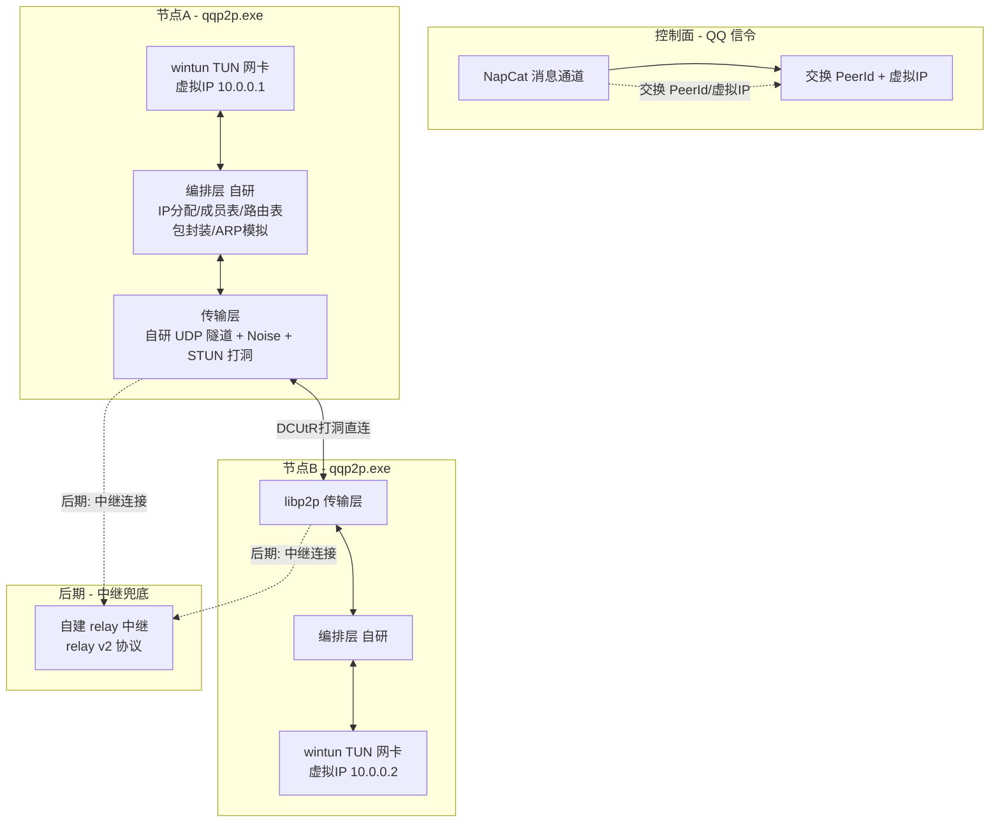

# P2P 基础设施实施计划（P2P_INFRA_PLAN）

> 文档时间：2026-08-24
> 关联文档：`docs/P2P_OVERLAY_RESEARCH.md`、`docs/P2P_LIBRARY_RESEARCH.md`、`docs/P2P_ECOSYSTEM_RESEARCH.md`、`docs/P2P_HOLE_PUNCHING.md`
> 决策影响：作为"虚拟网卡"主线（libp2p 传输 + 自研编排层）的实施图纸，里程碑任务照此执行

---

## 一、决策结论

三份调研 + 一轮选型讨论后，方向已定死：

| 决策项 | 结论 | 理由 |
|---|---|---|
| 主线目标 | **虚拟网卡**（任何软件透明互访） | 近期刚需 |
| 传输层 | **libp2p**（rust-libp2p） | 可自定义协议（`/tun/1.0.0`）、可魔改每一层；iroh 抽象封闭且只面向流，模型不匹配 TUN 包 |
| 打洞 | **DCUtR**（中继连接建立后自动升级直连） | libp2p 标准方案 |
| 中继兜底 | **后期计划**（见 N4），近期不依赖中继 | 先验证直连打洞真实穿透率，按需再投入 |
| TUN 网卡 | **wintun crate** | 微软已签名驱动，动态加载免安装 |
| 编排层 | **自研**（IP 分配/成员表/路由表/包映射/ARP 模拟） | 开源无现成可嵌入库，恰是护城河；参考 EasyTier 源码仅借鉴不抄（规避 LGPL） |
| 控制面 | **QQ 信令**（复用现有 NapCat 通道） | 零成本，天然唯一身份（QQ 号） |
| 现有 UDP 打洞 | 降级为**联调/调试工具**，不再承担主通道 | 保留 `holepunch` 命令行当诊断用 |

---

## 二、架构蓝图



### 分层职责

| 层 | 组件 | 职责 | 来源 |
|---|---|---|---|
| 传输层 | 自研 UDP 隧道（snow Noise_XX + STUN 打洞） | 加密通道、NAT 穿透、连接管理 | 自研 + 开源 |
| 打洞 | DCUtR | 尽力直连，失败留待中继兜底 | 开源 |
| 数据面 | `/tun/1.0.0` 自定义协议 | TUN 包封装 + 控制面消息 | 自研（协议） |
| 编排层 | 自研模块 | IP 分配、成员表、路由表、包映射、ARP/广播模拟 | **自研（护城河）** |
| TUN | wintun | 虚拟网卡 I/O | 开源 |
| 控制面 | QQ 信令 | 交换 PeerId、虚拟 IP、组网指令 | 已有 |

---

## 三、关键技术选型清单

| 项 | 选型 | 版本策略 |
|---|---|---|
| libp2p | `rust-libp2p`（crate `libp2p`） | **锁定版本**，启用 feature：`quic`、`tcp`、`noise`、`yamux`、`dcutr`、`relay`、`identify`、`ping`、`tokio` |
| Noise 加密 | crate `snow` | `Noise_XX_25519_ChaChaPoly_BLAKE2s`，自研 UDP 隧道端到端加密 |
| 异步运行时 | `tokio` | 与现有工程一致 |
| TUN | `wintun` crate | 锁版本；Windows 平台 |
| 日志 | `tracing` / `log` | 沿用现有 |
| 序列化 | `serde` + `bincode`（或 `postcard`） | 控制消息用，数据包走原始字节 |
| 配置 | `config.ini` 扩展 | 新增 `[p2p]` 段：虚拟网段、监听端口等 |

> 注意：libp2p 0.4x → 0.5x 有破坏性演进，N1 起锁定版本并在本文件标注，升级单独排期。

---

## 四、协议设计（`/tun/1.0.0`）

### 4.1 协议家族

| 协议 ID | 用途 |
|---|---|
| `/tun/1.0.0` | TUN 数据包 + 控制消息复用一条 stream/datagram |
| `/p2p/identify`、`/ipfs/ping/1.0.0` | libp2p 内建，连接自检 |

### 4.2 消息帧格式（控制面）

```
frame := [ 1B type ][ 4B len ][ payload ]
type 0x01 HELLO       payload: { peer_id, virtual_ip, features }
type 0x02 JOIN_ACK    payload: { members: [{peer_id, virtual_ip}] }
type 0x03 LEAVE       payload: { peer_id }
type 0x04 IP_CONFLICT payload: { virtual_ip }
type 0x05 DATA        payload: { src_ip, dst_ip, raw: [u8] }   // TUN 原始包
```

- 数据帧（`DATA`）优先走 datagram（尽力而为，IP 语义），无 datagram 时降级走 stream。
- 控制帧走 stream，保证可靠有序。

### 4.3 控制面消息（QQ 信令侧）

复用现有 NapCat 文本通道，定义一种消息格式：

```
p2p-join <peer_id> <virtual_ip> <endpoint_hint...>
```

- `peer_id`：libp2p PeerId 的 base58/hex 编码
- `virtual_ip`：编排层分配的虚拟 IP
- 后续按需扩展 `p2p-leave`、`p2p-list`

---

## 五、任务计划（里程碑）

### N0 方案定稿 —— 本文档 ✅

- [x] 架构、选型、协议、排期固化（本文件）
- 验收：文档评审通过

### N1 传输层 POC（1~2 周）

**目标**：跑通 libp2p 连接 + `/tun/1.0.0` 协议打通一条消息，实测直连穿透率。

任务步骤：

- [ ] N1.1 工程骨架：加 `libp2p` 依赖，新建 `src/p2p/` 模块（`mod.rs`、`transport.rs`、`protocol.rs`、`service.rs`）
- [ ] N1.2 `Endpoint` 启动：监听 + 打印 `PeerId`，`identify`/`ping` 自检
- [ ] N1.3 自定义协议：注册 `/tun/1.0.0`，实现 `HELLO` / `JOIN_ACK` 交换
- [ ] N1.4 手动联调：命令行子命令 `p2p connect <peer_id>` 打通一条测试消息
- [ ] N1.5 **实测（硬门槛）**：宽带 ↔ 手机热点场景跑 DCUtR 直连，记录穿透率；不达标则评估自研 UDP 隧道方案（见风险表）
- [ ] N1.6 写实测结论到本文件"实测记录"节

验收标准：
- 两台机器通过 PeerId 直连成功，消息互通
- 手机热点（对称 NAT）↔ 宽带场景实测穿透率有记录
- 端到端加密生效（noise）

### N2 编排层（2~4 周）

**目标**：TUN 网卡 + 编排逻辑，两台机器互 ping 通虚拟 IP。

任务步骤：

- [ ] N2.1 集成 `wintun`：创建 TUN 网卡，绑定虚拟 IP，UAC 提权引导
- [ ] N2.2 IP 分配：`10.0.0.0/24` 网段，启动时自选/协商虚拟 IP
- [ ] N2.3 成员表 + 路由表：维护在线成员、虚拟 IP → PeerId 映射
- [ ] N2.4 包映射：TUN 收包 → `DATA` 帧发给目标；收帧 → 写入 TUN
- [ ] N2.5 ARP/广播模拟：ARP 应答、广播包多播处理
- [ ] N2.6 组网自动化：`p2p-join` 信令触发自动互连（先走手动触发）
- [ ] N2.7 参考 EasyTier 源码校准实现细节（仅借鉴不抄）

验收标准：
- 两台机器 TUN 互 ping 通虚拟 IP（`ping 10.0.0.2`）
- ARP/广播语义正确（不依赖真实网关）

### N3 QQ 信令集成 + 一键安装（1~2 周）

**目标**：完整用户流程——双击 → 组网 → 互访。

任务步骤：

- [ ] N3.1 机器人消息解析 `p2p-join` 等指令，触发组网/退网
- [ ] N3.2 状态上报：机器人可查询在线成员、虚拟 IP 列表
- [ ] N3.3 一键安装：UAC 引导 + 驱动签名检查 + 失败回滚
- [ ] N3.4 打包：发布版 exe + 安装器（MSI 引导器方案）

验收标准：
- 两台机器从加群/私聊发指令到互 ping 通，全程无命令行操作

### N4 中继兜底（**后期计划**，按需启动）

> 明确：此里程碑不进入近期排期。仅在以下情况之一触发：
> - N1.5 实测直连穿透率不达标，且升级到自建 relay 后能达标
> - 用户网络环境大量出现"无法直连"反馈
> - 需要保证"任何网络都能连"的强 SLA

任务步骤（届时执行）：

- [ ] N4.1 自建 relay 服务器（Oracle 免费 ARM / 腾讯云轻量），部署 relay v2
- [ ] N4.2 客户端接入：启用 `relay` feature，自动连接中继作为兜底
- [ ] N4.3 DCUtR 升级路径完善：中继连接建立后自动尝试升级直连，成功后切换
- [ ] N4.4 relay 地址分发：写死配置 / QQ 信令下发二选一
- [ ] N4.5 带宽与限速控制（中继走量计费）

验收标准：
- 无法直连的双方经中继建立连接，且打洞成功后自动切直连

### N5 远期扩展（可选，不排期）

- 子网代理（访问对方局域网内设备）
- 多平台（Linux/macOS TUN）
- 性能优化（MTU 分片、多线程转发、NAT4-NAT4 打洞强化）

---

## 六、风险清单

| 风险 | 影响 | 对策 |
|---|---|---|
| **DCUtR 打洞穿透率在国内真实网络未知** | N1 可能卡壳 | N1.5 第一周就实测；不达标 → 评估"自研 UDP 隧道 + 对端告知法"（调研文档 10.3 节已有完整方案）或提前启动 N4 中继兜底 |
| **近期无中继兜底**（N4 前） | 严格 NAT 环境直连失败则无法组网 | 接受为近期约束；POC 阶段优先在可打洞环境验证；中继兜底已在后期排期 |
| libp2p 版本破坏性演进（0.4x→0.5x） | 升级成本高 | 锁定版本，本文档标注，N1 起固定 |
| wintun 需管理员权限 + 数字签名 | 安装体验受阻 | N3 阶段实现"一键 UAC + MSI 引导器"配方 |
| relay 服务器成本（N4 启动时） | 需要公网 VPS | Oracle 免费 ARM（4核24G）或腾讯云轻量新用户 |

---

## 七、验收总览

| 里程碑 | 一句话验收 |
|---|---|
| N0 | 本文件评审通过 |
| N1 | PeerId 直连 + 消息互通；手机热点↔宽带穿透率有实测记录 |
| N2 | 两台机器 TUN 互 ping 通虚拟 IP |
| N3 | 双击 → 组网 → 互访，全程无命令行 |
| N4（后期） | 无法直连时中继兜底，打洞成功自动切直连 |

---

## 八、实测记录

（N1.5 执行后回填：环境、结果、穿透率、结论）
